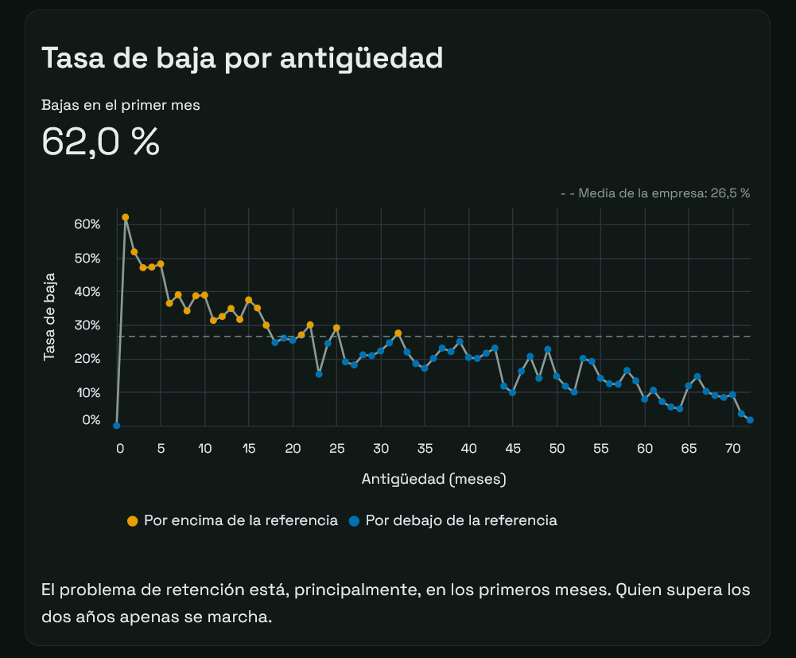
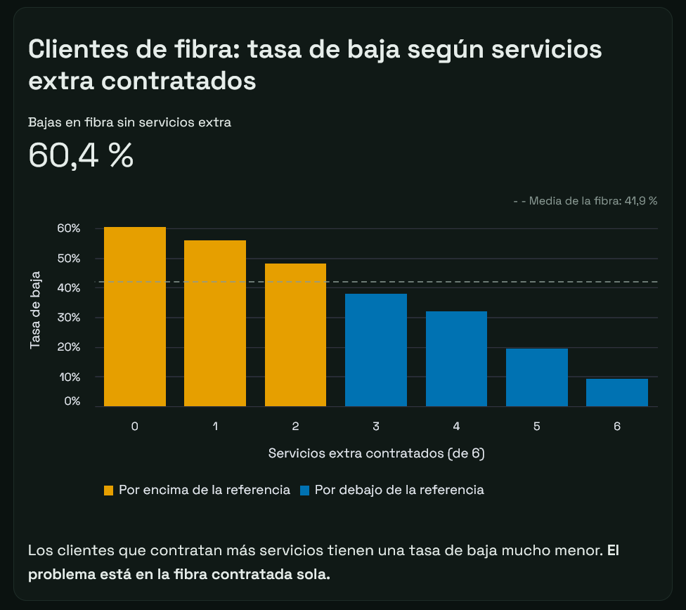
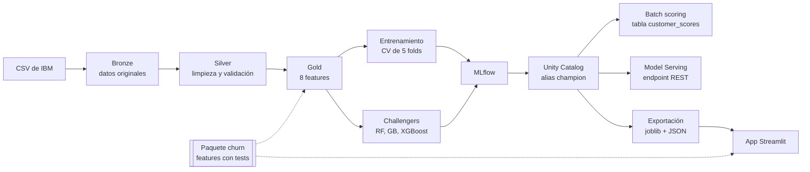

<div align="center">

# Databricks | Telco churn: predicción de bajas de clientes

Proyecto completo de machine learning, **desarrollado en Databricks**, de los datos en bruto a una app pública.


[](https://telco-churn-ramiro-caruso.streamlit.app/)

[](https://telco-churn-ramiro-caruso.streamlit.app/)

</div>

Ingesta por capas, features en un paquete propio con tests, seguimiento de experimentos con MLflow, registro del modelo en Unity Catalog, batch scoring, Model Serving y una app en Streamlit que cualquiera puede probar sin cuenta.

## En pocas palabras:

| | |
|---|---|
| **Problema** | Una operadora pierde al 26,5 % de sus clientes. Hay que saber a quién contactar primero. |
| **Datos** | IBM Telco Customer Churn: 7043 clientes, 20 variables. |
| **Modelo** | Regresión logística en un pipeline de scikit-learn. |
| **Resultado** | PR-AUC de 0,635 en test (un modelo al azar sacaría 0,265). |
| **Uso** | Lista mensual de 806 clientes en riesgo (15,6 % de los actuales) con umbral de 0,40. |
| **Plataforma** | Databricks Free Edition, MLflow, Unity Catalog, Streamlit Community Cloud. |

## Sobre el proyecto

- **Ingesta por capas (bronze, silver, gold)** en tablas Delta de Unity Catalog, con un contrato de validación en cada capa.
- **Análisis exploratorio** con hallazgos accionables: retención temprana, paradoja de Simpson en la fibra y una variable de confusión entre forma de pago y contrato.
- **8 features derivadas** en un paquete propio (`churn/`) con tests. La misma función calcula las features para entrenar, para puntuar y en la app, así que nunca divergen.
- **Elección de métrica y umbral** razonada: PR-AUC por el desbalanceo y un umbral de 0,40 a partir del coste de cada baja detectada.
- **Comparación de modelos** con MLflow y validación cruzada de 5 folds. Random forest, gradient boosting y XGBoost ajustados quedaron como challengers.
- **Puesta en producción**: registro con el alias `champion`, batch scoring a una tabla, endpoint REST con Model Serving y exportación del modelo para la app.
- **App pública** en Streamlit con seis pestañas, bilingüe (ES/EN) y con la lógica separada de la interfaz y testeada.

## Hallazgos del análisis exploratorio

| Hallazgo | Dato |
|---|---|
| Las bajas se concentran al principio | 62 % de bajas en el primer mes; el 15 % de la base con 3 meses o menos genera casi un tercio de todas las bajas |
| El contrato es la variable que más separa | 43 % en mensual, 11 % a un año, 3 % a dos años |
| Paradoja de Simpson | En general, más cuota implica más bajas. Dentro de la fibra se invierte: 56 % en la cuota más baja, 26 % en la más alta |
| El problema es la fibra contratada sola | 60 % de bajas sin servicios extra, 9 % con los seis |
| Variable de confusión | El cheque electrónico parece causar bajas, pero el 78 % de quien lo usa tiene contrato mensual. A igualdad de contrato, la diferencia sigue siendo de unos 20 puntos |
| No todos los servicios retienen igual | Seguridad online y soporte técnico: unos 27 puntos. Streaming: 3-4 puntos |

<table>
  <tr>
    <td></td>
    <td></td>
  </tr>
</table>

Los gráficos interactivos, con sus conclusiones y las recomendaciones para la empresa, están en la pestaña **Exploración** de la app.

## Arquitectura



Todo, salvo la app, se ejecuta en Databricks Free Edition. La app carga el modelo exportado y calcula las features con el mismo paquete que el entrenamiento.

## Modelo

| | |
|---|---|
| Algoritmo | Regresión logística (OneHotEncoder + StandardScaler en un `ColumnTransformer`) |
| Métrica de decisión | PR-AUC. Con un 26,5 % de bajas, la accuracy premiaría a un modelo que no detecta a nadie |
| PR-AUC en validación cruzada | 0,651 ± 0,021 (5 folds sobre entrenamiento) |
| PR-AUC en test | 0,635 sobre 1409 clientes no vistos |
| Umbral | 0,40, dentro del tramo 0,30-0,40, donde cada baja detectada cuesta alrededor de una llamada y media |
| Challengers | Superan al champion en unos 0,02 de PR-AUC, en el límite del ruido entre folds. Se mantiene la regresión logística por la explicabilidad de sus coeficientes |

## La app

| Pestaña | Qué hace |
|---|---|
| Resumen | Indicadores, arquitectura y decisiones clave |
| Cliente | Formulario con reglas de coherencia. Devuelve la probabilidad de baja y las variables que más la suben y la bajan |
| Lista de riesgo | Clientes actuales ordenados de mayor a menor riesgo, con filtros y descarga en CSV |
| Simulación | Cómo cambia la lista al pasar los meses y con altas nuevas |
| Exploración | Hallazgos del análisis exploratorio y recomendaciones para la empresa |
| Modelo | Matriz de confusión con umbral ajustable, curva PR, curva de ganancia, importancia de variables y comparación con los challengers |

La explicación de cada predicción es exacta para un modelo lineal: la aportación de cada variable es su coeficiente por la diferencia con el cliente medio de entrenamiento (equivale a los valores SHAP de un modelo lineal).

**Organización del código:**

```
app/
├── app.py        # interfaz: pestañas, widgets y gráficos
├── logica.py     # funciones puras: puntuar, simular, explicar, métricas (testeadas)
├── textos.py     # todos los textos en español e inglés
└── estilo.py     # CSS y cabecera
```

`logica.py` no importa Streamlit, así que se prueba con pytest sin arrancar la app.

## Cómo probarlo

**Online:** [telco-churn-ramiro-caruso.streamlit.app](https://telco-churn-ramiro-caruso.streamlit.app/)

**En local** (Python 3.12):

```bash
git clone https://github.com/Gabriel-Caruso/telco-churn-prediction.git
cd telco-churn-prediction
python -m venv .venv
.venv\Scripts\activate          # en macOS o Linux: source .venv/bin/activate
pip install -r app/requirements.txt
streamlit run app/app.py
```

La app se abre en `http://localhost:8501`. El modelo exportado necesita exactamente scikit-learn 1.6.1, que es la versión fijada en `app/requirements.txt`.

**Tests** (37: features y lógica de la app):

```bash
pip install pytest==8.3.5
pytest
```

**Pipeline completo en Databricks:** importa el repositorio en Databricks Free Edition como carpeta Git, ejecuta `00_setup` para crear el catálogo y los volúmenes, sube el CSV de IBM a `/Volumes/telco_churn/bronze/raw/telco_churn.csv` y ejecuta el resto de notebooks en orden, hasta `12_export_model`. `99_run_tests` lanza los tests dentro de Databricks.

## Estructura del repositorio

```
churn/          # paquete propio: configuración, features, pipeline y validaciones
notebooks/      # 00 a 12: setup, ingesta, EDA, capas, modelado, registro, scoring, serving, export
tests/          # tests de las features y de la lógica de la app
app/            # app de Streamlit, modelo exportado y datos que usa
docs/           # perfil de los datos e imágenes del README
```

| Notebook | Contenido |
|---|---|
| `01_ingestion` | CSV a la tabla bronze |
| `02_exploration` | Análisis exploratorio y conclusiones de negocio |
| `03_silver` / `04_gold` | Limpieza y features |
| `05_baseline` / `06_metrics` | Modelo base, elección de métrica y umbral |
| `07_mlflow` / `08_registry` | Comparación de modelos y registro en Unity Catalog |
| `09_batch_scoring` / `10_serving` | Puntuación por lotes y endpoint REST |
| `11_challenger` / `11a_hyperparameter_search` | Modelos ajustados frente al champion |
| `12_export_model` | Exportación del modelo y los datos para la app |

## Stack

Python · pandas · scikit-learn · XGBoost · MLflow · Databricks · Unity Catalog · Delta Lake · Model Serving · Streamlit · Altair · pytest
